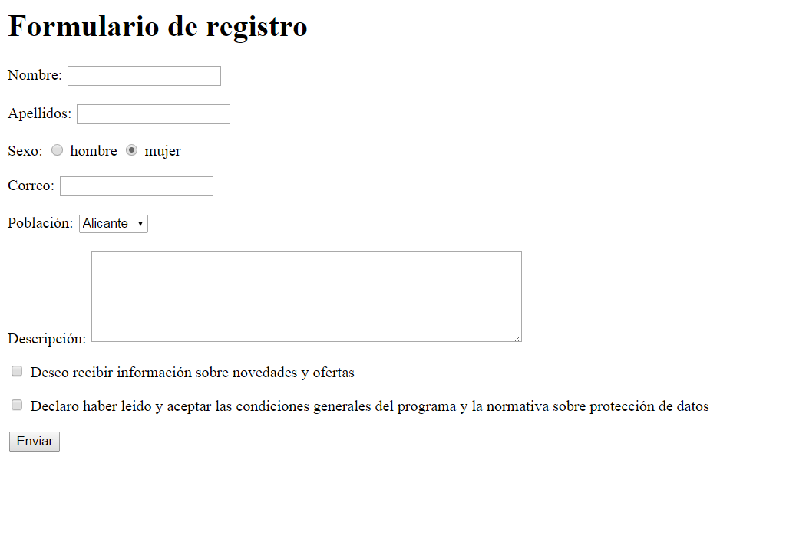

# React_01
Réplica de un formulario

## Enunciado

Realiza un proyecto React que replique el formulario, teniendo en cuenta que debes realizar el máximo número de componentes posibles siempre que tenga sentido.

## Cómo ejecutar

1.- Clona el repositorio.

2.- Instala las dependencias con `npm install`.

3.- Ejecuta `npm start`.